# OpenCode Agent Architecture

```mermaid
graph TB
    %% User Interface Layer
    subgraph "User Interfaces"
        TUI[Terminal TUI]
        Desktop[Desktop App]
        Web[Web Interface]
        IDE[IDE Extensions]
        API[API/SDK]
    end

    %% Core System
    subgraph "OpenCode Core"
        Core[Core Engine]
        SessionMgr[Session Manager]
        ConfigMgr[Configuration Manager]
    end

    %% Agent System
    subgraph "Agent System"
        subgraph "Primary Agents"
            Build[Build Agent<br/>Full Tools]
            Plan[Plan Agent<br/>Restricted]
        end
        
        subgraph "Subagents"
            General[General Agent<br/>Multi-step]
            Explore[Explore Agent<br/>Read-only]
            Custom[Custom Agents<br/>Specialized]
        end
    end

    %% Tool Layer
    subgraph "Core Tools"
        FileOps[File Operations]
        SystemOps[System Operations]
        AIOps[AI-Powered Features]
    end
    
    subgraph "File Operations"
        Read[Read Files]
        Write[Write Files]
        Edit[Edit Files]
        Glob[Glob Search]
        Grep[Grep Search]
    end
    
    subgraph "System Operations"
        Bash[Bash Commands]
        Git[Git Operations]
        Pkg[Package Management]
    end
    
    subgraph "AI Features"
        Analysis[Code Analysis]
        Implement[Feature Implementation]
        Refactor[Refactoring]
        Debug[Debugging]
        Docs[Documentation]
    end

    %% Integration Layer
    subgraph "Integrations"
        LLM[75+ LLM Providers]
        MCP[MCP Servers]
        LSP[LSP Support]
        Plugins[Plugin System]
        Skills[Agent Skills]
        CustomTools[Custom Tools]
    end

    %% Configuration
    subgraph "Configuration"
        JSON[JSON Config]
        Markdown[Markdown Agents]
        Permissions[Permissions]
        Themes[Themes]
        Keybinds[Keybindings]
    end

    %% Storage & Management
    subgraph "Storage & Management"
        SQLite[Persistent Storage]
        Sharing[Session Sharing]
        MultiAgent[Multi-agent Orchestration]
        Compaction[Context Compaction]
    end

    %% Connections
    TUI --> Core
    Desktop --> Core
    Web --> Core
    IDE --> Core
    API --> Core
    
    Core --> SessionMgr
    Core --> ConfigMgr
    Core --> Build
    Core --> Plan
    
    Build --> General
    Build --> Explore
    Build --> Custom
    Plan --> General
    Plan --> Explore
    Plan --> Custom
    
    Build --> FileOps
    Build --> SystemOps
    Build --> AIOps
    Plan --> FileOps
    General --> FileOps
    General --> SystemOps
    General --> AIOps
    Explore --> FileOps
    
    FileOps --> Read
    FileOps --> Write
    FileOps --> Edit
    FileOps --> Glob
    FileOps --> Grep
    
    SystemOps --> Bash
    SystemOps --> Git
    SystemOps --> Pkg
    
    AIOps --> Analysis
    AIOps --> Implement
    AIOps --> Refactor
    AIOps --> Debug
    AIOps --> Docs
    
    Core --> LLM
    Core --> MCP
    Core --> LSP
    Core --> Plugins
    Core --> Skills
    Core --> CustomTools
    
    ConfigMgr --> JSON
    ConfigMgr --> Markdown
    ConfigMgr --> Permissions
    ConfigMgr --> Themes
    ConfigMgr --> Keybinds
    
    SessionMgr --> SQLite
    SessionMgr --> Sharing
    SessionMgr --> MultiAgent
    SessionMgr --> Compaction

    %% Styling
    classDef userInterface fill:#e1f5fe,stroke:#01579b,stroke-width:2px
    classDef core fill:#f3e5f5,stroke:#4a148c,stroke-width:2px
    classDef agent fill:#e8f5e8,stroke:#1b5e20,stroke-width:2px
    classDef tools fill:#fff3e0,stroke:#e65100,stroke-width:2px
    classDef integration fill:#fce4ec,stroke:#880e4f,stroke-width:2px
    classDef config fill:#f1f8e9,stroke:#33691e,stroke-width:2px
    classDef storage fill:#e0f2f1,stroke:#004d40,stroke-width:2px
    
    class TUI,Desktop,Web,IDE,API userInterface
    class Core,SessionMgr,ConfigMgr core
    class Build,Plan,General,Explore,Custom agent
    class FileOps,SystemOps,AIOps,Read,Write,Edit,Glob,Grep,Bash,Git,Pkg,Analysis,Implement,Refactor,Debug,Docs tools
    class LLM,MCP,LSP,Plugins,Skills,CustomTools integration
    class JSON,Markdown,Permissions,Themes,Keybinds config
    class SQLite,Sharing,MultiAgent,Compaction storage
```

## Key Features Overview

### Agent Types
- **Primary Agents**: Direct user interaction (Tab key switching)
- **Subagents**: Specialized tasks (@ mention invocation)

### Tool Access Levels
- **Build Agent**: Full access to all tools
- **Plan Agent**: Restricted access (analysis only)
- **General Agent**: Full access except todo
- **Explore Agent**: Read-only access

### Integration Capabilities
- **75+ LLM Providers**: OpenAI, Anthropic, local models
- **Extensible Architecture**: Plugins, custom tools, agent skills
- **Development Tools**: LSP, MCP, git integration

### Configuration Flexibility
- **JSON-based**: Global and project-specific settings
- **Markdown Agents**: Easy-to-read agent definitions
- **Permission System**: Fine-grained access control